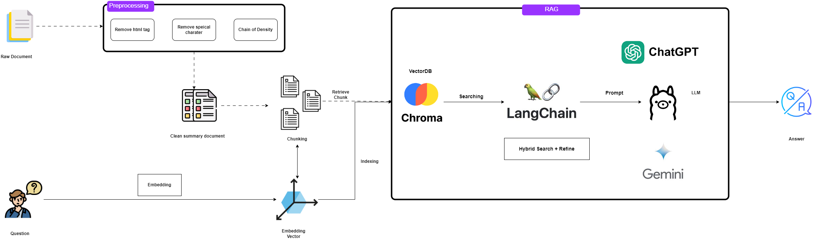
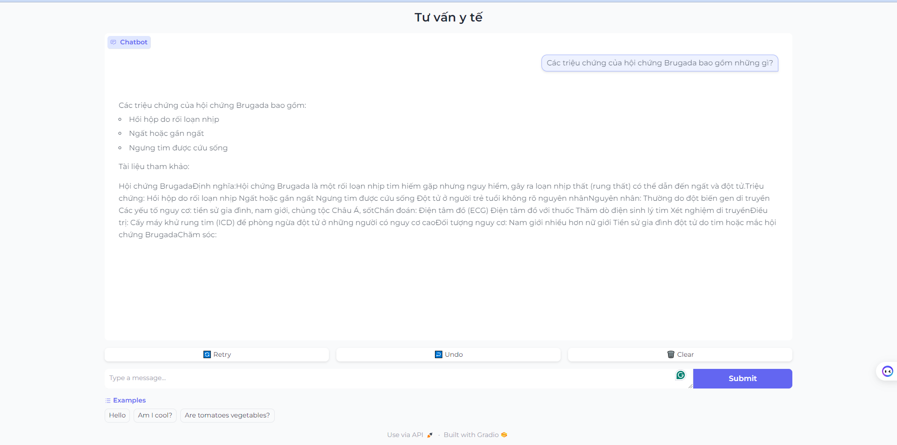

# Vietnamese Healthcare Chatbot
 
Project for starting LLM on medical data.

## 1. Introduction

This project aims to build a Vietnamese healthcare chatbot leveraging advanced Retrieve-Augment-Generate (RAG) capabilities, such as Hybrid Search, Density Chain, and Re-ranking. The chatbot is designed to provide accurate and helpful health-related information and support.
## Overall data architecture



## Demo


### Key features:

**🌟 Advanced RAG Capabilities:**  Utilizing Hybrid Search, Density Chain, and Re-ranking to enhance information retrieval and generation.

**🌟 Model Experimentation:**  Testing various LLM models, including GPT, Gemini, Vistral,Vinallama etc., to find the best fit for different use case

**🌟 Model and Embedding Selection** : Allowing users to choose the most appropriate model and embeddings to create a personalized assistant.

**🌟 User-Friendly Interface:**  Using Gradio to create an intuitive and easy-to-use interface for beginners.

## 2. How to use?
### Getting Started
```
git clone https://github.com/luongphambao/medical_llm.git
cd medical_llm
```
```
conda create -n medical_llm python=3.10
conda activate medical_llm
```
```
pip install -r requirements.txt
```

### Create Embedding

``` 
python src/embedding.py   --model_name="BAAI/bge-m3" --cache_dir="cache/" --persist_directory="chroma_db_bge" --corpus_path="corpus_summarize"
```
### Predict (generate answer for Kalapa competition)

if you predict with opensource model, you can use the following command to start ollama server for serving the model.

```
ollama serve (you can install ollama based on the instruction in the following link: https://github.com/ollama/ollama)
```

Predict with the model
``` 
python3 src/predict.py --model_embedding_name="BAAI/bge-m3" --cache_dir="cache/" --persist_directory="chroma_db_bge" --corpus_path="corpus_summarize" --csv_path="data/public_test.csv" --output_path="submit.csv" --corpus_path="corpus_summarize" --model_name="BAAI/bge-m3"
```
### Demo Web 
Add the OpenAI API KEY in the **.env** file.
```python
OPENAI_API_KEY=sk-...
GOOGLE_API_KEY=AI-...
```
Then, you can run the **app.py** file and a Gradio interface will appear.
```
python -m  run app.py
```
